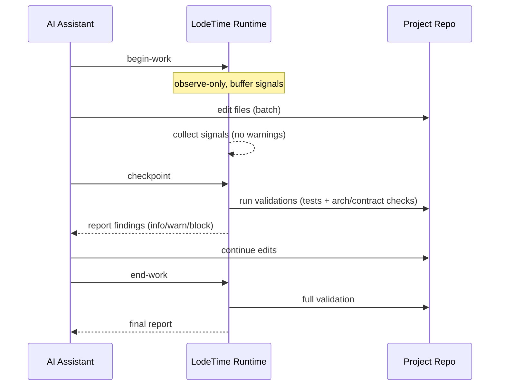
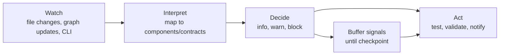

# 2026-02-01 — LodeTime Architecture Notes

## Context

LodeTime is a long‑running BEAM runtime that maintains an internal model of components, dependencies, and contracts by watching the filesystem (directly or via a watcher that notifies the runtime). In normal use it watches **some other project**; in this repo it watches **itself** (dogfooding), which creates extra mental overhead.

At this stage the architecture is still a rough draft: components were sketched from a short AI conversation and captured in `.lodetime/`, with narrative in `docs/design/` and `docs/discussion/`. The goal now is to firm up the overall system architecture enough to define components and how they *can* talk to each other (not necessarily how they *must*), while leaving room for experimentation and design iteration.

## High‑level goals

- Make architecture and intent **live** and queryable during development.
- Provide useful feedback loops (status, drift, tests, docs) without being intrusive.
- Deliver tangible capability at each phase (0–3) with clear usage and validation steps.

## System boundaries (current framing)

**Is**
- A long‑running runtime that reads architecture specs, tracks project state, and provides status/actions.
- Two‑way communication: humans/AI can *Ask* (query) and *Tell* (write), while the system *Watches* and reacts to change.

**Isn’t (yet)**
- Fully autonomous code generation or refactoring.
- A replacement for CI/CD or all project tooling.
- A system that silently mutates code without explicit intent.

## Watch → Interpret → Act (draft pipeline)

**Signals**
- File change events (code/spec/docs)
- Explicit commands from CLI
- Git diff (optional later)
- Graph changes (architecture dependency/contract graph updated)

**Interpretation**
- Which components/contracts are impacted?
- Does this violate a schema or contract?
- Does this imply a documentation update?

**Actions (examples)**
- Trigger tests (targeted or full)
- Surface warnings about doc drift or contract mismatch
- Update status/health summary
- Suggest next steps (not auto‑commit)

Note: Graph changes should be treated as a first‑class signal. The system may not know whether the change is intentional; the default behavior could be to inform or warn rather than block.

## Validation protocol (avoid “over‑the‑shoulder” noise)

LodeTime should avoid interrupting the AI while it is mid‑edit. Suggested model:

- **Work session / checkpoint protocol**:
  - AI (or user) signals: `begin-work` → LodeTime shifts to *observe‑only* (collects signals, no warnings).
  - AI signals: `checkpoint` → LodeTime runs validations (tests/lint/contract checks) on the current snapshot.
  - AI signals: `end-work` → LodeTime runs full validation and reports results.

- **Quiescence window** (fallback when no explicit signal):
  - If no changes for N seconds, treat as a safe checkpoint and run validations.

This allows AI to complete a “train of thought” before LodeTime starts commenting. Warnings/errors are buffered until a checkpoint.

## Architecture linting (concept)

Yes, this is a real concept. Call it **architecture conformance checks** or **architecture linting**:
- Validate that dependencies obey allowed directions.
- Validate that contracts referenced by a component exist and are compatible.
- Validate that declared components are implemented (or explicitly stubbed).
- Validate that runtime topology still matches `.lodetime/`.

In practice, these checks run as part of the validation protocol above.

## Runtime environment constraints (draft)

Static architecture correctness is not sufficient: runtime environments add constraints that can invalidate an otherwise “correct” design. Examples include:
- Network boundaries (ports, DNS, service discovery, segmentation)
- Resource limits (CPU, memory, file descriptors, disk/IO)
- OS/runtime capabilities (filesystem access, sockets, clock, permissions)
- Dependency availability (DB/queue endpoints, credentials, secrets)
- Distributed topology (single node vs cluster, latency, consistency)

**Idea:** model these as **runtime constraints** or **environment profiles**, distinct from component/contract specs. LodeTime can then perform:
1) **Static compatibility checks** (architecture vs environment spec)
2) **Startup checks** (probe runtime, fail fast with clear guidance)
3) **Continuous checks** (telemetry/health validation in Phase 2+)

Open question: where should these live (e.g., `.lodetime/environments/`), and how strict should enforcement be (warn vs block)?

## Ambition: runtime vs environment (draft guidance)

Running the full system under test may be impractical (too large, too distributed, or dependent on external services). We should **not** assume LodeTime can run the full SUT/SUD locally in early phases.

Suggested approach (KISS‑first, layered ambition):

**Level 0 — Documented environment assumptions**
- Capture required services, ports, secrets, and constraints in an environment profile.
- Treat this as *source of truth* for compatibility (not inferred).

**Level 1 — Static compatibility checks**
- Parse config/IaC/CI files to build an **inventory** of runtime requirements.
- Compare inventory vs environment profile; warn on mismatches.
- Do **not** attempt to run the full system.

**Level 2 — Lightweight probes (Phase 2+)**
- Optional health checks against declared dependencies (if reachable).
- Validate that required endpoints/ports are reachable *when explicitly requested*.

**Level 3 — Runtime simulation / AI interpretation (future)**
- Only if needed: consult AI to interpret ambiguous config or deployment intent.
- Keep this explicitly scoped to avoid autonomy drift.

Notes:
- “SUT” is the common term; “SUD” is less standard. We can refer to “target runtime” or “dev environment.”
- LodeTime should focus on **compatibility and clarity**, not full execution, until later phases.

## Architecture‑aware config/IaC validation (draft)

**Position:** LodeTime should be an *architecture‑aware config/IaC validator* (static, deterministic, high‑signal).

### 1) Configuration correctness (high value, but bounded)

LodeTime can do this *without AI* if it sticks to deterministic checks:
- Validate config file schema/types (YAML/JSON).
- Detect missing required keys when the contract explicitly declares them.
- Detect mismatched defaults (contract says “required”, config missing).

**Scope guardrail:** Only validate against **declared contracts**. No inference.  
If contracts are missing, LodeTime should **warn** and suggest documentation updates.

**Signal to AI assistant:** raise a structured warning (e.g., `CONFIG_MISSING_KEY`) that the AI can consume, but do not auto‑fix.

### 2) Deployment / IaC consistency (high value, static)

LodeTime should not “interpret” IaC semantically at first; it should:
- **Inventory** declared services/resources (Compose, K8s, Terraform, CI).
- Compare to architecture dependencies and contracts.
- Warn on missing or extra resources.

If ambiguity exists, the *default action* is to require documentation rather than guessing.

### External tools (linters / policy‑as‑code)

- **IaC linters**: can be invoked as optional “adapters” (Phase 2+).  
  Use them as *external checks* whose results LodeTime can surface, not as a hard dependency.

- **Policy‑as‑code**: if present, LodeTime should detect and **report** policy locations, even if it doesn’t enforce them.

### Outcome

LodeTime provides a **map** connecting architecture → config → IaC, and flags inconsistencies.  
This keeps scope practical while still delivering unique value.

## Dev environment & distribution (draft)

LodeTime is more than a CLI binary; it is a **runtime environment**. That implies higher friction (container + resources), but also predictability and portability.

### Audience (draft)
- Primary: developers and architects working in active codebases.
- Secondary: AI assistants that operate in the same repo (needs CLI access).

### Constraints vs opportunities
- **Constraint:** requires container runtime + enough memory/CPU.
- **Opportunity:** consistent environment, deterministic behavior, fewer “works on my machine” issues.

### Installation / onboarding options

**Option A — One‑liner bootstrap (recommended)**
- `curl ... | sh` (or OS‑specific installers) sets up a lightweight wrapper + container image.
- Followed by `lode run` to start the runtime.
- Lowest friction for cross‑platform, aligns with “just works.”

**Option B — Guided setup (oh‑my‑zsh style)**
- Interactive Q&A to configure paths, ports, features.
- Better for first‑time setup; slightly more work to maintain.

**Option C — VS Code extension**
- Useful for IDE integration but excludes other editors.
- Good *later* as a convenience layer, not as the primary distribution.

### Recommendation (for now)
- Start with **Option A** (one‑liner + `lode run`).
- Add **Option B** when configuration grows.
- Defer **Option C** until core runtime is stable.

Open question: should LodeTime support a **non‑container mode** for small projects, or is container‑only a firm constraint?

### Container runtime & VS Code workflows (draft)

**Container engines:** Docker is the default, but the wrapper should be able to target Podman (and possibly nerdctl/colima) via auto‑detect or config.

**Scenario A — Local host (no devcontainer)**
- `lode run` uses the detected container engine (Docker/Podman) to start the runtime container.
- `lode status` talks to loopback JSONL endpoint.

**Scenario B — VS Code devcontainer**
Two viable modes:
1) **Embedded runtime (default)**  
   - `lode run` starts the BEAM runtime *inside the devcontainer*.  
   - No extra container; lowest friction in VS Code.
2) **Sidecar runtime (compose)**  
   - Devcontainer uses docker‑compose; runtime runs as a sibling service.  
   - `lode run` attaches to the sidecar logs; CLI targets the service endpoint.

**Scenario C — AI assistant in container**
- Same as devcontainer mode; CLI uses an environment‑provided endpoint (e.g., `LODE_RUNTIME_ENDPOINT`).

**Auto‑detect order (suggested):**
1) If inside devcontainer → **embedded runtime**  
2) Else if container engine available → **container runtime**  
3) Else → clear error + install guidance

Goal: keep `lode run` consistent while letting the backend vary by environment.

### Detection & overrides (draft)

**Devcontainer detection (heuristics):**
- Environment variables: `DEVCONTAINER`, `REMOTE_CONTAINERS`, `VSCODE_REMOTE_CONTAINERS`, `CODESPACES`
- Optional: presence of `/.dockerenv` + `/workspaces` (as a weak signal)

**Container engine detection (order):**
1) Explicit config (`lode config set engine=...`)
2) `DOCKER_HOST` / `PODMAN_HOST` env vars
3) `docker` CLI available
4) `podman` CLI available
5) `nerdctl` CLI available

**Runtime endpoint overrides (order):**
1) CLI flags (`--endpoint`, `--engine`)
2) Environment variables (`LODE_RUNTIME_ENDPOINT`)
3) Project config (`.lodetime/lode.yaml` or `.lode/config.yaml`)
4) User config (`~/.config/lode/config.yaml`)
5) Auto‑detect

This keeps `lode run` predictable while still allowing explicit control when needed.

## Workflow: getting started (draft)

Assumes **one runtime per repo** and container‑first default.

### 1) From zero (new repo, no LodeTime setup)
1. Install wrapper: `curl -sSL https://get.lodetime.dev | sh`
2. Initialize: `lode init` (creates `.lodetime/` skeleton + config)
3. Start runtime: `lode run`
4. Verify: `lode status`

### 2) Resume (repo already has `.lodetime/`)
1. `cd` into the repo
2. `lode run` (connects to existing runtime or starts it)
3. `lode status` (confirm graph + contracts load)

### 3) New project, LodeTime already used elsewhere
1. Install wrapper (once per machine): `curl -sSL https://get.lodetime.dev | sh`
2. In new repo: `lode init`
3. `lode run` → `lode status`

Notes:
- If running inside a devcontainer, `lode run` starts the runtime inside the container (embedded mode).
- If running on the host, `lode run` starts a per‑repo container and persists state via a volume.
- Override option: set `LODE_RUNTIME_MODE=host` inside a devcontainer to force host‑per‑repo runtime (survives devcontainer rebuilds).

## CLI: capability discovery (draft)

If external tools/adapters are configurable, the CLI should expose a way to list them.

**Naming options (geology‑friendly but clear):**
- `lode tools` (straightforward; lowest cognitive load)
- `lode inventory` (clear; hints at what’s available)
- `lode survey` (geology‑flavored; “what’s in the ground”)
- `lode assay` (geology‑flavored but less obvious)

Recommendation: **`lode tools`** for clarity, with `lode tools --json` and `lode tools --check` as future flags.

Metrics idea: surface tool usage stats (last run, duration, exit status, resource cost) so slow/heavy tools are visible. This can start as a lightweight log and mature into structured metrics later.

### Minimal tool metrics schema (draft)

Goal: start with a **small, stable** JSONL record per tool run.

```yaml
tool_run:
  run_id: string            # unique ID
  tool_id: string           # matches registry/inventory
  started_at: timestamp     # ISO 8601
  duration_ms: number
  status: ok|warn|error
  exit_code: number
  notes?: string
  resources?:               # optional, phase 2+
    cpu_ms?: number
    max_rss_mb?: number
```

Storage idea: append JSONL to a local log (e.g., `.lodetime/metrics/tools.jsonl`). Summaries can be derived later.

## Schema evolution (draft)

We should track schema changes intentionally, but keep it lightweight:

1) **Version fields**: include a `schema_version` in `.lodetime/` specs (or per file type).
2) **Change log**: maintain a short `docs/design/SCHEMA-CHANGES.md` with versioned entries.
3) **Phase notes**: when a phase introduces a breaking schema change, note it in that phase’s docs.

This is “as‑we‑go,” but **structured** enough to avoid silent drift.

## Core runtime components (draft)

Phase‑1 critical path:
- **config‑loader**: loads `.lodetime/` into runtime
- **graph‑server**: owns component dependency graph + contracts
- **cli‑socket**: runtime query/command interface
- **cli**: human entry point (e.g., `lodetime status`)

Phase‑2/3 extensions:
- **file‑watcher**: change events → runtime signals
- **validation runner**: check contracts/schemas/drift
- **test‑runner**: run relevant tests on change
- **notifications**: surface findings (CLI, logs, future dashboard)
- **MCP server** (Phase 3): AI integration endpoint

Open consideration: Should LodeTime ever call out to AI itself to interpret ambiguous changes? If so, this is likely Phase 3+ and should be explicitly scoped to avoid autonomy drift.

## Phase deliverables (needs explicit scope + usage)

Each phase should ship:
- **What it does** (capabilities)
- **What it does NOT do** (explicit non‑goals)
- **How to use it** (commands, examples)
- **How to validate it** (tests, expected output)

Proposed structure (to keep history but avoid process interference):
- `docs/phases/IMPLEMENTATION-PHASES.md` = overview + current phase
- `docs/phases/phase-0/README.md` (and phase‑1/2/3)
- `docs/phases/phase-0/USAGE.md`
- `docs/phases/phase-0/TESTING.md`

Suggestion: Create stubs for each phase upfront, then fill details as phases are implemented and wrapped.

## Diagram candidates (for clarity)

1) **Roles & Channels** (who talks to whom)  
2) **Validation protocol** (work session / checkpoint)  
3) **Runtime flow** (watch → interpret → act)

These can live in this discussion note or be promoted to `docs/design/` once stabilized.

### Diagram 1: Roles & Channels


### Diagram 2: Validation Protocol (work session / checkpoint)



### Diagram 3: Runtime Flow (watch → interpret → act)



Epics/milestones remain in `dev/` and are not tied 1:1 to phases.

## Open questions for next discussion

1. What is the **minimal “status” payload** in Phase 1?
2. What are **allowed actions** on file change in Phase 2?
3. Which **contract violations** should be enforced vs reported?
4. Where should “phase usage” docs live (phase folders vs a single evolving doc)?
5. Which parts of `.lodetime/` are authoritative vs derived?

---

## Phase 1 decisions (draft)

- **Minimal runtime split:** config‑loader reads/validates `.lodetime/`, graph‑server builds graph + contract map for queries.
- **Failure handling:** input errors keep runtime up in *degraded* mode with a clear error summary and “last known good graph” timestamp; internal crashes are treated as bugs with clear reporting.
- **Run mode:** Phase 1 uses **foreground** `lode run` only (no daemon/stop/restart yet).
- **Persistence:** Phase 1 rebuilds from disk; durable queues/journals/snapshots are deferred to Phase 2+.
- **Commands (Phase 1):** `lode run`, `lode status`, and a minimal `lode check` stub (non‑blocking, informational).
- **`lode doctor` (future):** optional diagnostic command (environment sanity checks, config health, runtime subsystem status). Not required in Phase 1.
- **CLI protocol:** pluggable transports; default **TCP loopback + JSONL** framing (good for logging/event streams). Future adapters: UDS, stdio.

Notes:
- “Daemon mode” = running in the background (service), not attached to a terminal. We’ll add it only if needed later.

### Component spec impact (current)

Reviewed `.lodetime/components` at this stage:
- **config-loader** and **graph-server** responsibilities match the Phase‑1 split (load/validate → build graph).
- **cli-socket** is currently described as TCP; if we change transport semantics later, we should revisit this spec.

No component spec changes required yet; track future adjustments via `component-refine` as decisions solidify.

### Contract spec impact (current)

Reviewed `.lodetime/contracts` at this stage:
- **graph-api** aligns with Phase‑1 queries; `update_status` is a mutation we may defer until Phase 2+.
- **cli-protocol** updated to be pluggable: default TCP loopback with JSONL framing; future UDS/stdio adapters allowed.
- **mcp-tools** is Phase 3+ and can remain as‑is for now.

No contract spec changes required yet; note the potential deferrals above.

## Next steps

- Review this draft and adjust terminology/structure.
- Decide the Phase documentation structure.
- Confirm the minimal runtime interface for Phase 1.

## TODO — Topics to discuss (long form)

1) **Phase 0 (manual mode)**  
   - Exact deliverables (what “done” looks like)  
   - Minimum `.lodetime/` schema completeness  
   - How humans/AI should use it without runtime

2) **Phase 2 (watcher + validation protocol)**  
   - Which signals trigger checks?  
   - What checks run at checkpoint vs full?  
   - How does LodeTime avoid spam (severity levels)?

3) **Phase 3 (MCP + advanced workflows)**  
   - What MCP tools are actually exposed?  
   - How “tell” works vs “ask”.

4) **Runtime state & durability**  
   - What “durable queue” means in practice.  
   - Where logs/metrics live and how they’re retained.

5) **User workflows (day‑to‑day)**  
   - “How do I use this as a developer?”  
   - “How do I use this as an architect?”  
   - “How does AI benefit from LodeTime in practice?”

6) **Contracts & schemas**  
   - What belongs in `.lodetime/contracts` vs `.lodetime/components`.  
   - How strictly contracts are enforced.

7) **Observability**  
   - What metrics/logs exist in each phase.  
   - What the minimal “status” output contains.
