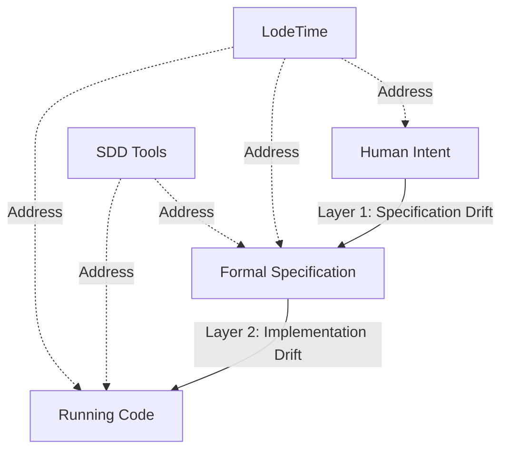

# Spec-Driven Development, Drift, and LodeTime

> Deep analysis of the SDD movement and how it validates — and diverges from — LodeTime's approach.

**Context:** The article ["Code Is Easy, Intent Is Hard: The Case for Spec-Driven Development"](https://medium.com/@rajesh.sgr/code-is-easy-intent-is-hard-the-case-for-spec-driven-development-fbd9893d9c13) argues that code is a lossy compression of intent, and that specifications — not code — should be the source of truth. This is part of a broader wave of Spec-Driven Development (SDD) thinking, also explored in the [InfoQ architecture piece](https://www.infoq.com/articles/spec-driven-development/), the [arxiv paper on SDD with AI assistants](https://arxiv.org/html/2602.00180v1), [Tessl's spec-centric vision](https://tessl.io/blog/from-code-centric-to-spec-centric), and [Böckeler's tool comparison on martinfowler.com](https://martinfowler.com/articles/exploring-gen-ai/sdd-3-tools.html).

This analysis examines how the drift problem maps to what LodeTime is building, where the overlap is, and where LodeTime occupies genuinely different ground.

---

## The Drift Problem

The SDD movement is unified around one observation:

> "Requirements documents exist, but they drift. Design diagrams are drawn, but they rot."

Every software project starts with intent: what should be built, why, and how the pieces fit together. Traditional development encodes that intent into code, then discards the specification artifacts. As the code evolves — bug fixes, edge cases, dependency upgrades — the connection between *what we meant* and *what the code does* erodes. This is drift.

The SDD literature identifies drift as a systemic failure, not a discipline problem:

- **It's a lossy pipeline.** Each translation step — requirements to design, design to implementation, implementation to deployment — introduces reinterpretation and hidden assumptions.
- **It's discovered late.** Drift typically surfaces through production incidents rather than being caught proactively.
- **It's accelerated by AI.** Tools like Copilot and Cursor generate code faster, but without intent context they amplify drift rather than prevent it. Speed without direction is just faster divergence.

The proposed fix: invert the hierarchy. Make specifications the authoritative source of truth, with code derived from (or continuously validated against) them.

---

## The Vibe Coding Problem

Rajesh's article gives drift a visceral, practitioner-level framing: **vibe coding** — prompting an AI, accepting the output because it "looks right," and moving on. Velocity increases, but system integrity slowly erodes.

> "The issue isn't that AI writes bad code. The issue is that AI doesn't understand your system unless you explicitly teach it."

He identifies three specific failure modes when AI generates code without intent context:

**1. Architectural blindness.** AI defaults to generic structures. Unless explicitly told about your chosen patterns — Command Pattern, Hexagonal Architecture, DDD — it produces code that works in isolation but violates system-level design rules.

**2. The redundant code loop.** Without knowledge of the existing codebase, AI recreates utilities and helpers that already exist, leading to duplication and gradual divergence.

**3. Invisible technical debt.** AI optimizes for immediate correctness, not long-term maintainability. Edge cases are missed, error handling is oversimplified, tight coupling creeps in — problems that only surface when the system needs to evolve.

The instinctive response is better prompting: longer instructions, architecture reminders, "follow best practices" guidance. But Rajesh's key insight is that this is a category error:

> "Prompts describe tasks. They don't encode intent."

Prompts are not versioned, not reviewed like code, and rarely reused consistently across teams. They are ephemeral. Specs are durable. This is the gap SDD claims to fill.

---

## The SDD Spectrum

Not all SDD is the same. Böckeler's framework identifies three maturity levels:

| Level | Spec Role | Code Role | Drift Strategy |
|-------|-----------|-----------|----------------|
| **Spec-first** | Guides initial build | Becomes truth after | Drift inevitable |
| **Spec-anchored** | Evolves with code | Validated against spec | Drift detected |
| **Spec-as-source** | Only human-edited artifact | Generated, disposable | Drift impossible by construction |

Current tools map to these levels:
- **Kiro** (AWS): Spec-first — requirements/design/tasks as markdown, but specs are abandoned post-build
- **GitHub Spec Kit**: Aspires to spec-anchored but behaves as spec-first (branch-per-spec lifecycle)
- **Tessl**: Pursues spec-as-source — code marked "GENERATED FROM SPEC - DO NOT EDIT"

The InfoQ article frames the most ambitious vision: a five-layer execution model (Specification, Generation, Artifact, Validation, Runtime) where drift detection forms a closed-loop feedback system that "continuously compares what the system claims to do with what actually happens."

---

## The Concrete Shape of a Spec

What makes Rajesh's article actionable is the concrete spec example. His order-processing spec captures three layers:

```
1. Architectural Constraints — pattern, allowed dependencies, validation schema
2. Business Logic Contract — input, requirements, state transitions
3. Anti-Debt Rules — error handling patterns, forbidden practices
```

This is strikingly close to what a `.lodetime/` component YAML already captures:

| SDD Spec Layer | LodeTime Equivalent |
|----------------|---------------------|
| Architectural Constraints (pattern, dependencies) | Component YAML: `depends_on`, `zone`, allowed imports |
| Business Logic Contract (input, behavior) | Contract YAML: API contracts, data contracts, behavioral contracts |
| Anti-Debt Rules (error handling, forbidden patterns) | Rules: dependency direction enforcement, contract coverage |

The formats differ — SDD specs are typically markdown consumed by AI during generation, while `.lodetime/` YAML is consumed by a running validation engine — but the *information* is the same. Both answer: what pattern should this follow, what can it depend on, and what must it never do?

The difference is in *when* and *how* this information is enforced. Rajesh proposes CI/CD pipeline validation: ArchUnit for dependency boundaries, BDD tests for behavioral contracts, automated drift detection at push time. LodeTime proposes the same enforcement but running *continuously during development* rather than at commit boundaries.

> "Spec drift and AI hallucination are not edge cases; they are expected failure modes whenever intent is implicit. The only reliable countermeasure is to anchor AI-assisted development in deterministic specs and enforce them through CI/CD."

LodeTime agrees with the diagnosis but proposes a different prescription: enforce through a living runtime, not just CI/CD.

---

## Where LodeTime Intersects

LodeTime is not an SDD tool. It doesn't generate code from specs, and it doesn't treat specifications as the sole human-editable artifact. But it attacks the same root problem — drift — from a different angle, and in some ways a more pragmatic one.

### Shared Ground

**1. Intent as a first-class artifact.**
SDD says: specs encode intent, code is derivative. LodeTime says: `.lodetime/` YAML encodes architectural intent — planned components, contracts, zones, rules — and the system continuously validates code against that intent. The mechanism differs (declarative YAML vs formal specifications), but the principle is identical: intent must be explicitly stated and machine-readable, not buried in code comments or Confluence pages.

**2. Continuous validation over periodic checking.**
The InfoQ article describes drift detection as a "closed-loop feedback control system." LodeTime's checkpoint validation protocol is exactly this: file changes trigger targeted validation, contracts are checked at explicit boundaries, and violations produce graded severity responses (info → warn → error → block). This is the same architectural insight — validate continuously, fail fast — implemented as a runtime companion rather than a CI pipeline.

**3. Planned components solve a problem SDD doesn't even address.**
SDD assumes you're specifying what exists. LodeTime tracks what *doesn't exist yet* — planned components with explicit `planned → implementing → implemented → deprecated` lifecycles. This is a superset of SDD's scope. When an AI tool queries LodeTime, it knows not just what the system does, but what it's *intended to become*. No SDD tool in the current landscape offers this.

**4. AI as a consumer of structured intent.**
The SDD movement is driven partly by the need to give AI coding assistants better context. LodeTime's MCP integration serves the same purpose — providing structured context (component status, dependencies, contracts, violations) so AI tools can reason about intent, not just syntax. Both approaches recognize that AI amplifies whatever paradigm it's embedded in: garbage-in, garbage-out; intent-in, intent-out.

**5. Direct counter to all three failure modes.**
Rajesh's three AI failure modes map precisely to LodeTime capabilities:

| AI Failure Mode | SDD Solution | LodeTime Solution |
|----------------|--------------|-------------------|
| Architectural blindness | Spec defines patterns/constraints | Graph server knows component patterns, zones, dependencies; MCP exposes this to AI |
| Redundant code loop | Spec references existing modules | `lodetime_context` tells AI what exists, what's planned, what depends on what |
| Invisible technical debt | Anti-debt rules in spec | Rules engine validates dependency direction, contract coverage; severity escalation (warn → error → block) |

The crucial difference: SDD's solution requires the AI to *read and follow* the spec (which Böckeler notes AI frequently ignores). LodeTime's solution provides the same information *and* validates the output independently. The AI doesn't need to follow rules if the validation engine catches violations regardless.

### Where LodeTime Diverges

**1. LodeTime doesn't replace code — it watches it.**
SDD's most ambitious form (spec-as-source) treats code as disposable and regenerable. LodeTime takes the opposite stance: code is human-written and valuable, but it needs a companion that understands the architecture it's supposed to implement. This is a fundamental philosophical difference. SDD says "make drift impossible by construction." LodeTime says "make drift visible and correctable in real time."

**2. Runtime awareness vs. build-time enforcement.**
SDD tools operate at build time — specs are checked during CI, contracts validated during deployment. LodeTime operates at *development time*, running alongside the developer as a persistent BEAM process. This is a different temporal model. SDD catches drift when you push; LodeTime catches drift while you type. The work session protocol (begin-work → observe → checkpoint → end-work) has no analog in SDD tooling.

**3. Zones and gradual adoption.**
SDD demands uniform rigor — if specs are truth, all code must conform. LodeTime's zone system (core/legacy/tests/docs) allows differentiated treatment. Legacy code gets full tracking but relaxed rules. Tests get no tracking. This "ratcheting" strategy — start permissive, gradually tighten — is engineered for real-world adoption where not everything can be spec'd on day one. The SDD literature largely ignores this adoption challenge.

**4. Process state, not just architectural state.**
SDD tracks what the system *is* (contracts, schemas, behaviors). LodeTime also tracks what the development *process* is — what's blocked, what changed recently, what's healthy, what's degraded. This runtime state (green/yellow/red health, recent activity, blocking relationships) is ephemeral and development-focused. No SDD tool maintains this kind of situational awareness.

---

## The Deeper Insight: Two Layers of Drift

Reading the SDD literature through LodeTime's lens reveals that "drift" actually has two distinct layers, and most SDD tools only address one:



**Layer 1 — Specification drift:** The gap between what a human intends and what's captured in a spec. SDD tools assume this gap is closed by the act of writing specs. But specs rot too — the arxiv paper admits "specifications inherit source-code properties: technical debt, coupling, compatibility inertia." A spec that no one updates is just documentation with a fancier name.

**Layer 2 — Implementation drift:** The gap between a spec and the running code. This is where SDD tools focus: contract testing, schema validation, code generation.

LodeTime's unique position is that it operates across *both* layers. The `.lodetime/` definitions capture human-curated intent (Layer 1), and the continuous validation engine checks code against that intent (Layer 2). The planned-component lifecycle is explicitly designed to track intent *before* it becomes a spec or code. This is the gap that SDD tools leave open.

---

## AI Governance as Technical Debt Governance

Rajesh reframes the AI governance conversation in a way that directly validates LodeTime's positioning:

> "Much of the AI governance discussion focuses on models, policies, and access control. For engineering teams, the more immediate risk is simpler: unchecked AI can mass-produce technical debt."

This is exactly the layer LodeTime operates at. Not model governance (who can use what AI), but *output governance* (is the AI-produced code architecturally sound). LodeTime's component graph, contract definitions, and validation engine are a governance layer for AI-generated code — one that operates at development time, not audit time.

The SDD governance stack as Rajesh describes it:

```
Specs encode architectural intent
    → CI/CD enforces compliance
        → Reuse is mandated, not optional
            → Technical debt is prevented upstream
```

LodeTime's equivalent:

```
.lodetime/ YAML encodes architectural intent
    → Runtime companion enforces compliance continuously
        → Graph server exposes existing code to AI (preventing reinvention)
            → Validation catches drift before it becomes debt
```

Same stack. Different enforcement timing. LodeTime's is earlier.

---

## Risks and Warnings from SDD for LodeTime

The SDD literature raises concerns that apply to LodeTime. Rajesh is honest about them, and so should we be.

**1. Specification fatigue / over-engineering specs.**
Böckeler warns that extensive spec files create "tedious, repetitive review experiences." Rajesh warns that "teams may attempt to capture every edge case upfront, creating heavy, brittle specifications that slow iteration. Specs should constrain intent, not predict the future." LodeTime's YAML is lightweight compared to formal specs, but as projects grow, maintaining `.lodetime/` accuracy becomes a discipline burden. The zone system helps, but the risk of YAML rot is real. LodeTime must resist the temptation to make component definitions exhaustive — they should capture *constraints*, not *details*.

**2. False confidence.**
Rajesh: "A poorly written spec can create a false sense of safety. AI will comply perfectly with an unclear spec and still produce flawed systems." LodeTime's equivalent: a poorly defined component YAML or an incomplete contract gives `lode check` something to validate against, but the validation is only as good as the definition. Garbage-in on the YAML side means garbage-out on the validation side. SDD "moves engineering judgment earlier — it doesn't eliminate it." Same is true for LodeTime.

**3. The Model-Driven Development cautionary tale.**
SDD critics draw parallels to MDD, which failed because models became inflexible and the abstraction layer added more friction than it removed. LodeTime avoids this by not generating code, but the parallel still holds: any system that interposes a layer between developer and code must justify its overhead continuously.

**4. Spec drift is real (and Rajesh admits it).**
"If teams change code without updating specs, the spec loses credibility. The discipline only works when specs evolve alongside implementation and are treated as living artifacts." This is the strongest argument for LodeTime's always-running model: a BEAM process watching your filesystem can *detect* when code changes without corresponding `.lodetime/` updates. A static spec file cannot detect its own obsolescence.

**5. Cognitive shift / learning curve.**
Rajesh: "Writing good specs requires architectural clarity and shared standards. Teams must invest time in developing this muscle." LodeTime requires the same muscle — architecture-first reasoning. The bootstrap strategy (using LodeTime to build LodeTime) is the right move here: prove the value on yourself, document the patterns, then teach others.

**6. Validator trust.**
SDD worries about trusting code generators. LodeTime's equivalent risk is trusting the validation engine. If `lode check` says you're clean but the architecture has actually drifted, false confidence is worse than no checking at all. Validation correctness is a first-class engineering concern.

---

## What LodeTime Should Take From SDD

Several SDD concepts could strengthen LodeTime's approach:

**1. Anti-debt rules as a first-class concept.**
Rajesh's spec template includes an explicit "Anti-Debt" section — not just what to build but what *patterns to forbid*. LodeTime's rules engine already enforces dependency direction and contract coverage, but the concept of explicit anti-patterns per component (e.g., "this component must never use try/catch directly; use the Result wrapper") would add a valuable layer of protection. This could be a `constraints` or `anti_patterns` field in component YAML.

**2. Formal contract testing.**
LodeTime defines contracts in YAML, but the validation layer (Phase 2+) should consider SDD-style contract testing frameworks (Pact, Specmatic) as inspiration for how to verify contracts at runtime, not just structurally.

**3. Compatibility policies.**
The InfoQ article describes "governed evolution with explicit compatibility policies" — breaking vs. non-breaking changes to specs. LodeTime contracts could benefit from explicit versioning and compatibility rules, especially as AI tools become consumers of contract definitions.

**4. CI/CD as a second enforcement layer.**
Rajesh positions CI/CD as the enforcement mechanism. LodeTime's runtime validation catches drift earlier, but there's no reason it can't *also* integrate with CI/CD as a second gate. `lode check --strict` as a CI step would complement the development-time companion model. Runtime catches drift while you code; CI catches what you missed.

**5. The "ambient code" concept.**
Tessl's idea that generated code is disposable is extreme, but the underlying insight — that *some* code is more disposable than others — maps well to LodeTime's zone model. Generated boilerplate in a `legacy` zone vs. core business logic in `core` could receive different levels of contract enforcement.

---

## What SDD Should Take From LodeTime

The SDD movement has blind spots that LodeTime's design addresses:

**1. Always-running > CI-triggered.**
Checking specs at push time means drift accumulates during development. LodeTime's quiescence-based checkpoint model catches drift as it happens, not after the fact.

**2. Planned components.**
SDD tools have no concept of "what we intend to build." They can only validate what exists. An SDD tool augmented with planned-component awareness would be significantly more useful for AI-assisted development.

**3. Development process as state.**
SDD treats the system as a static artifact to validate. LodeTime treats development as a dynamic process to support. Knowing that a component is "blocked by X" or "degraded since commit Y" is operational context that no spec can capture.

**4. Gradual adoption.**
The zone/ratchet model is LodeTime's answer to the all-or-nothing rigidity that killed MDD and threatens SDD. Real projects have legacy code, experimental branches, and varying levels of spec maturity. Any drift-prevention system must accommodate this reality.

---

## Conclusion: Same War, Different Weapons

> "AI can generate code at extraordinary speed. Only engineers can define what good systems look like."

The SDD movement and LodeTime are fighting the same war against drift — the slow, inevitable divergence between what we mean and what the code does. They share the conviction that intent must be explicit, machine-readable, and continuously validated. They agree that the problem isn't AI writing bad code — it's AI that doesn't understand the system it's writing code for.

Where they differ is in strategy:

| Dimension | SDD | LodeTime |
|-----------|-----|----------|
| **Core artifact** | Formal specification | Architecture-as-YAML |
| **Code's role** | Derived / disposable | Human-written / watched |
| **Enforcement** | CI/CD pipeline gates | Runtime companion (continuous) |
| **Adoption model** | All-or-nothing | Gradual (zones + ratcheting) |
| **Scope** | What the system IS | What the system IS + WILL BE + IS DOING |
| **AI relationship** | AI reads spec, generates code | AI queries companion, companion validates output |
| **Process awareness** | None | Health, blocking, activity, session state |
| **Spec drift defense** | Discipline (hope specs stay updated) | Detection (runtime notices when code changes without YAML updates) |

LodeTime's positioning is validated by SDD's rise: the industry recognizes that drift is a real problem, that code-as-truth is broken, and that AI amplifies both good and bad development paradigms. Rajesh's framing of AI governance as technical debt governance is particularly resonant — it describes exactly the layer LodeTime operates at.

But LodeTime's approach — a living companion rather than a static spec system — may be more resilient to the adoption and flexibility challenges that have historically killed specification-heavy methodologies. SDD says "write the spec before the code." LodeTime says "declare the architecture, and I'll watch whether the code respects it — continuously, while you work, not just when you push."

The strongest position: not "we do SDD too" but "we operate at the layer SDD can't reach — the living, breathing development process where drift actually happens." SDD prevents drift by construction. LodeTime prevents drift by vigilance. In practice, you probably want both.
